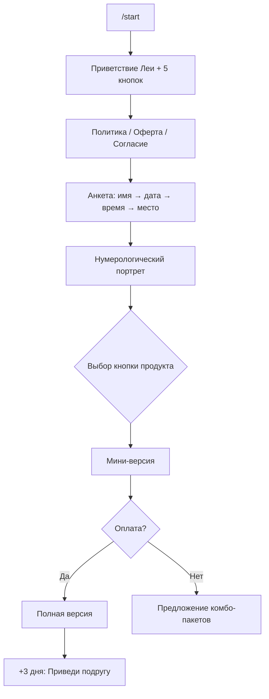

# Проект: миграция Arcana AI → бот «Лея» (tarot-lena)

Статус: **[Planned]** — проектирование, реализация не начата.

## 1. Контекст

| Параметр | Сейчас (Arcana AI) | Цель (Лея) |
|----------|-------------------|------------|
| Репозиторий | `Fullfaq-dev/arcane-ai` | `https://github.com/Fullfaq-dev/tarot-lena.git` |
| VPS / путь | `/opt/arcane-ai`, `arcaneai.online` | **Zeabur** `43.165.5.18`, `/opt/tarot-lena`, домен позже |
| Бот | `@arcane_ai_bot` | **`@astro_leia_bot`** (токен в `.env`, не в git) |
| Персона | Нейтральный «эзотерический наставник Arcana AI» | **Лея** — женский голос, таро + нумерология + западный зодиак |
| Монетизация | Баланс + подписки Plus/Premium + pay-per-token | **Фиксированные продукты** + комбо-пакеты + подписки |
| Языки | ru / en / es / pt | **Только ru** (на старте) |

**База для форка:** текущий репозиторий `TAROT — заказ` (стек Python/FastAPI/aiogram/Docker остаётся).

---

## 2. Продуктовая модель (из ТЗ)

### 2.1. Главное меню (5 кнопок)

| Кнопка | Продукт | Цена (полная) |
|--------|---------|---------------|
| 💞 Любовь | Совместимость / отношения | 550 ₽ |
| 💰 Деньги | Нумерологический расчёт богатства | 390 ₽ |
| 🛡️ Негатив | Энергетическая диагностика | 300 ₽ |
| 🔮 Личный прогноз | На день / неделю / месяц | 550 ₽ |
| 💡 Ответ на вопрос | Свободный вопрос в чат | 500 ₽ |

**Паттерн продажи:** у каждого продукта — **мини-версия (бесплатно)** → кнопка **[Полная расшифровка]** → оплата.

### 2.2. Комбо-пакеты

| Пакет | Цена | Состав |
|-------|------|--------|
| «Счастливая женщина» | 990 ₽ | Любовь + Деньги + Прогноз на месяц |
| «ЛЮБОВЬ+» | 1 200 ₽ / мес | Безлимит запросов по отношениям |
| «VIP-пакет» | 2 300 ₽ / мес | Все функции без лимитов |

### 2.3. Бесплатный контент

| Тип | Когда | Кому |
|-----|-------|------|
| Утренняя рассылка | Каждое утро | Подписавшиеся; новым — **1 неделя** |
| Нумерологический портрет (мини) | После ввода даты рождения | Всем, кто не выбрал продукт |
| Еженедельный гороскоп | По понедельникам | Всем подписанным |
| Вечерний расклад | 20:00 | Если пользователь не заходил днём |
| Мини-расклад (день 2 воронки) | День 2 | Неактивные |

### 2.4. Реферальная программа

- Через **3 дня после покупки** — сообщение «Приведи подругу».
- Скидка **20%** на все продукты по реферальной ссылке.
- Формат ссылки: `https://t.me/<bot>?start=ref_<id>`.

---

## 3. Пользовательские воронки

### 3.1. День 1 — активный пользователь



### 3.2. День 2 — неактивный

1. Карта дня + предложение подписаться на утреннюю рассылку.
2. Если не зашёл сам — «Привет, вчера была карта…» + бесплатный мини-расклад (Отношения / Деньги / Совет).
3. Если не купил — повтор пакетов со скидками.

### 3.3. Утренняя рассылка (шаблон)

```
🔔 ДОБРОЕ УТРО, {имя}!
🌞 Сегодня {дата}
🃏 КАРТА ДНЯ: {аркана} — {значение}
🔢 ЧИСЛО ДНЯ: {число} — {совет}
♍ АСТРОСОВЕТ: {по знаку}
⭐ СОВЕТ ДНЯ: {аффирмация}
[кнопки продуктов]
```

### 3.4. Еженедельный гороскоп (понедельник)

Персональный прогноз по знаку зодиака: любовь, деньги, здоровье, карта-покровитель недели + кнопки продуктов.

---

## 4. Методологии ИИ

| Область | Метод | Промпт |
|---------|-------|--------|
| Нумерология | Классика + Матрица Судьбы (Хшановская) | Новый `prompts/numerology_ru.md` |
| Таро | Матрица Судьбы / Аркан года | Расширить `prompts/tarot_ru.md` |
| Астрология | Тропический (западный) зодиак | Новый `prompts/astro_ru.md` |
| Личность бота | Лея, женский род | Переписать `prompts/system_ru.md` |

**Убрать из MVP:** Zen, руны, камни, браслет, аура/ладонь, голосовые ответы, мультиязычность.

---

## 5. Изменения в кодовой базе

### 5.1. Что переиспользуем без изменений

- Docker Compose, worker, Redis FSM, Alembic, Platega SDK.
- `TarotService`, колода карт, отправка фото карт.
- `NotificationScheduler` (расширить, не переписывать).
- `ReferralService` (адаптировать скидку 20%).
- Admin-панель (упростить метрики под новые продукты).
- Platega-платежи (новые `purpose` вместо `subscription_plus`).

### 5.2. Новые модули

```
backend/app/services/
  products/           # каталог, цены, entitlements
    catalog.py
    entitlements.py
  numerology/         # жизненный путь, число года, денежный код
    service.py
    matrix.py         # матрица Хшановской (расчёт без ИИ)
  astrology/          # знак зодиака, недельный/дневной совет
    service.py
  funnels/            # день 1/2, состояние воронки
    service.py
  broadcasts/         # утро, понедельник, вечер
    morning.py
    weekly.py
    evening.py
```

### 5.3. Изменения БД (новая миграция)

```sql
-- Новые таблицы
product_purchases       -- разовые покупки (product_id, mini/full, paid_at)
product_entitlements    -- активные права (love_unlimited, vip, combo_happy_woman)
funnel_state            -- день воронки, last_activity, opted_morning_digest
partner_profiles        -- дата рождения партнёра для «Любви»
referral_discounts      -- 20% скидка по рефералу (expires_at)

-- Изменения существующих
users: убрать/не использовать balance_rub для новых покупок (или оставить для реф. выплат)
subscriptions: tier → product_vip | product_love_plus | free
user_settings: + morning_digest_enabled, + weekly_horoscope_enabled, + evening_digest_enabled
               + free_morning_week_ends_at (дата окончания недели бесплатной рассылки)
onboarding_sessions: шаги → name, birth_date, birth_time, birth_city, legal_consent
```

### 5.4. Биллинг: новая модель

**Вместо** `BillingService.charge_rub` по токенам:

```python
PRODUCTS = {
    "love_full":          Decimal("550"),
    "forecast_month":     Decimal("550"),
    "wealth":             Decimal("390"),
    "negative":           Decimal("300"),
    "question":           Decimal("500"),
    "combo_happy_woman":  Decimal("990"),
    "sub_love_plus":      Decimal("1200"),  # 30 дней
    "sub_vip":            Decimal("2300"),   # 30 дней
}
```

Platega `purpose`: `product_love_full`, `product_combo_happy_woman`, `subscription_love_plus`, и т.д.

**Entitlements после оплаты:**
- Разовый продукт → 1 полная расшифровка выбранной темы.
- Комбо → 3 полных разбора (флаги в `product_entitlements`).
- Подписка → проверка `expires_at` + счётчик/безлимит по типу.

### 5.5. Бот: handlers

| Файл | Действие |
|------|----------|
| `handlers.py` | Упростить меню до 5 продуктов + юридическое согласие |
| `keyboards.py` | Новые inline-клавиатуры продуктов и пакетов |
| `states.py` | Состояния: анкета, ввод даты партнёра, свободный вопрос |
| `i18n.py` | Только ru; тексты из ТЗ |
| `feature_handlers.py` | Удалить zen/runes/stones/bracelet |
| `onboarding/service.py` | Новые шаги + legal_consent + портрет после даты |

### 5.6. Scheduler (worker)

| Задача | Расписание | Условие |
|--------|-----------|---------|
| Утренняя рассылка | 09:00 по timezone | `morning_digest_enabled` |
| Бесплатная неделя | то же | `free_morning_week_ends_at >= today` |
| Гороскоп недели | Пн 09:00 | все onboarded |
| Вечерний расклад | 20:00 | не заходил с 09:00 |
| Воронка день 2 | 11:00 день+1 | `funnel_state.day == 1` и нет активности |
| Реферал «подруга» | +3 дня после покупки | `product_purchases` |

---

## 6. Инфраструктура (утверждено)

### 6.1. Сервер Zeabur

| Параметр | Значение |
|----------|----------|
| IP | `43.165.5.18` |
| SSH user | `ubuntu` |
| App path | `/opt/tarot-lena` |
| Домен | **пока нет** — работа по IP (см. ADR-003) |
| Аутентификация деплоя | SSH-ключ в GitHub Secrets (пароль — только для первичной настройки, **не в git**) |

### 6.2. Telegram-бот

| Параметр | Значение |
|----------|----------|
| Username | `@astro_leia_bot` |
| Ссылка | `https://t.me/astro_leia_bot` |
| Deep link лендинга | `https://t.me/astro_leia_bot?start=landing` |
| Режим MVP | **long polling** (без HTTPS webhook) |
| Админы | `267409502`, `7670490295` |

### 6.3. Платежи

- **Platega** — тот же мерчант (credentials с текущего проекта).
- Return URL: `http://43.165.5.18/payment/success` / `failed`.
- Callback: `http://43.165.5.18/callbacks/platega` (проверить поддержку HTTP).

### 6.4. Пользователи и рассылки

- **Чистый старт** — без миграции из Arcana AI.
- Утренняя рассылка: **09:00** по `user_settings.timezone`.
- Вечерний расклад: **20:00** по `user_settings.timezone`.
- Недельный гороскоп: **понедельник 09:00** по timezone.

### 6.5. Юридические документы

Файлы в корне проекта (конвертировать в `site/legal.html` на Фазе 4):

- `Политика конфиденциальности и обработки персональных данных.docx`
- `Согласие на обработку персональных данных.docx`
- `Публичная оферта на оказание услуг.docx`

Оператор: **Карпова Елена Игоревна**, ИНН 234594723806, elenakarpva@gmail.com.  
Сервис в оферте: «ИИ астролог Лея».

### 6.6. Репозиторий и CI

- Git: `https://github.com/Fullfaq-dev/tarot-lena.git`
- GitHub Secrets: `VPS_HOST=43.165.5.18`, `VPS_USER=ubuntu`, `VPS_SSH_KEY`, `TELEGRAM_BOT_TOKEN`, Platega, KIE
- Deploy target: `/opt/tarot-lena`

### 6.7. `.env` (шаблон для VPS)

```env
APP_NAME="Лея — Таро и Нумерология"
APP_ENV=production
PUBLIC_BASE_URL=http://43.165.5.18

TELEGRAM_BOT_TOKEN=<секрет>
TELEGRAM_USE_POLLING=1
TELEGRAM_ADMIN_IDS=267409502,7670490295
OWNER_TELEGRAM_ID=7670490295
LEGAL_PAGE_URL=http://43.165.5.18/legal

# Platega — те же ключи
PLATEGA_RETURN_URL=http://43.165.5.18/payment/success
PLATEGA_FAILED_URL=http://43.165.5.18/payment/failed

# KIE, Postgres, Redis, JWT — сгенерировать новые на VPS
```

### 6.8. Лендинг

- Перебрендировать `site/index.html`: Лея, `@astro_leia_bot`.
- `site/legal.html` — тексты из трёх docx.

---

## 7. Что убираем из MVP

- Мультиязычность (en/es/pt).
- Баланс с пополнением «на произвольную сумму».
- Подписки Plus/Premium по токенам.
- Zen, руны, камни, браслет, vision (аура/ладонь).
- Голосовые ответы (ElevenLabs) — опционально позже.
- USDT-вывод реферальных (можно оставить заготовку, но не в MVP).
- Gift за подписку на канал.

---

## 8. Фазы реализации

### Фаза 0 — Подготовка (1–2 дня)
- [ ] Создать репозиторий `tarot-lena`, перенести код
- [ ] Поднять VPS, домен, SSL, `.env`
- [ ] Зарегистрировать webhook нового бота
- [ ] Обновить OpenSpec и progress

### Фаза 1 — Ядро продукта (3–5 дней)
- [ ] Персона Лея + промпты (нумерология, астрология, таро)
- [ ] Новый onboarding + legal consent
- [ ] Нумерологический портрет после даты рождения
- [ ] 5 продуктов: мини → полная версия
- [ ] Каталог цен + Platega checkout

### Фаза 2 — Пакеты и подписки (2–3 дня)
- [ ] Комбо «Счастливая женщина»
- [ ] Подписки ЛЮБОВЬ+ и VIP
- [ ] Entitlements и проверки доступа

### Фаза 3 — Рассылки и воронки (2–3 дня)
- [ ] Утренняя рассылка (карта + число + астро + аффирмация)
- [ ] Еженедельный гороскоп (понедельник)
- [ ] Воронка день 1/2
- [ ] Вечерний расклад 20:00

### Фаза 4 — Рефералы и полировка (1–2 дня)
- [ ] «Приведи подругу» + скидка 20%
- [ ] Лендинг и legal-страницы
- [ ] Admin: продукты, воронки, рассылки
- [ ] E2E-тест основных сценариев

---

## 9. Решённые вопросы

| # | Вопрос | Ответ |
|---|--------|-------|
| 1 | Домен | Пока только IP `43.165.5.18` (Zeabur, user `ubuntu`) |
| 2 | Username бота | `@astro_leia_bot` |
| 3 | Platega | Тот же мерчант |
| 4 | Юр. тексты | 3 docx в корне проекта → `site/legal.html` |
| 5 | Миграция | С нуля |
| 6 | Админы | `267409502`, `7670490295` |
| 7 | Рассылки | 09:00 / 20:00 / Пн 09:00 по timezone пользователя |

**Остаётся:** колода Таро — по умолчанию «Божественное наследие» (как в текущем проекте).

---

## 10. Безопасность

- Токен бота и SSH-пароль — **только** `.env` / Secrets, **никогда в git**.
- Рекомендуется: SSH-ключ для деплоя, смена пароля root/ubuntu после настройки.
- JWT, `POSTGRES_PASSWORD` — новые на VPS.
